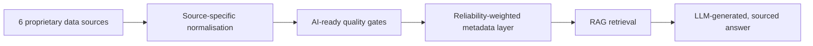
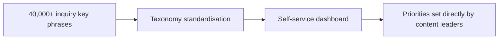
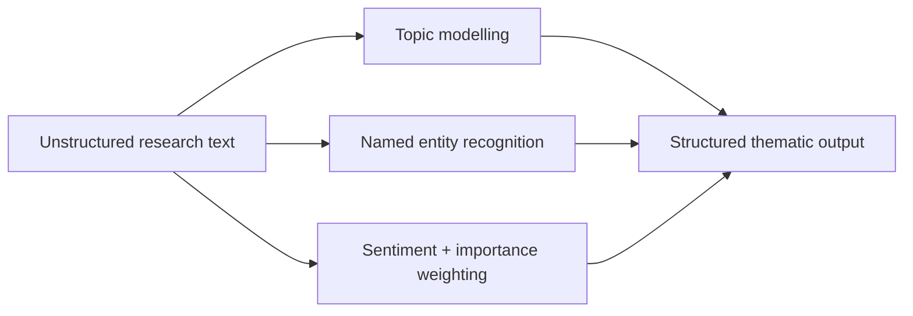
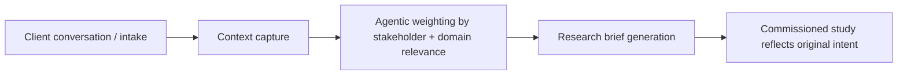
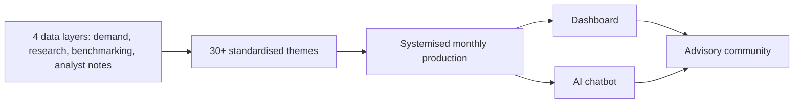
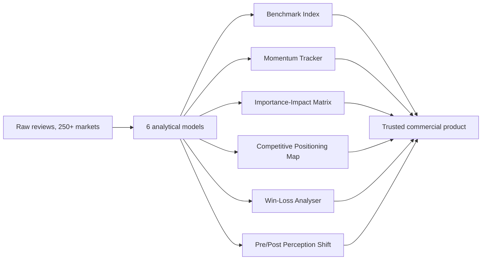

# AI Systems Casebook

Architecture, data, and measurement design for large-scale AI systems delivered in an enterprise research and advisory setting — documented here as system case studies. No proprietary code or client data; each entry describes the architecture, the design decisions, and the measured outcome.

**Jump to a case:**
[Enterprise Research AI Platform](#enterprise-research-ai-platform) · [Self-Service Demand Analytics](#self-service-demand-analytics) · [NLP Thematic Coding Engine](#nlp-thematic-coding-engine) · [Agentic Research Commissioning Tool](#agentic-research-commissioning-tool) · [Executive Intelligence Systemisation](#executive-intelligence-systemisation) · [Voice-of-Customer Analytics Transformation](#voice-of-customer-analytics-transformation)

---

## 🔍 Enterprise Research AI Platform

A retrieval-augmented research platform unifying six differently-structured proprietary data sources into a single AI-ready pipeline. Each source carries a reliability weighting in its metadata, so the retrieval layer never treats a single unverified opinion with the same trust as a validated benchmark study — the failure mode that makes most RAG systems confidently wrong.

**Result:** 85%+ retrieval precision on a 200-query benchmark, with full data lineage and confidence scoring live at go-live.

`RAG Architecture` `Data Governance` `Multi-Source Integration` `Confidence Scoring`

---

## 📊 Self-Service Demand Analytics

A self-service analytics dashboard replacing multi-day manual data pulls, built on a standardised taxonomy spanning 40,000+ inquiry key phrases. Content leaders query demand signals directly instead of filing a request and waiting.

**Result:** 75% reduction in downstream dataset size through taxonomy standardisation; changed how research priorities get set.

`Demand Analytics` `Taxonomy Design` `Self-Service BI`

---

## 🧠 NLP Thematic Coding Engine

An in-house NLP platform replacing outsourced qualitative coding — extracting themes, entities, and sentiment from unstructured research text while retaining the domain context that external vendors lacked.

**Result:** Eliminated 100% of outsourced coding cost, with faster turnaround.

`NLP` `Thematic Analysis` `Cost Elimination`

---

## 🤖 Agentic Research Commissioning Tool

An agentic AI tool that keeps client context intact from first conversation through to research delivery — weighting stakeholder input by domain relevance so briefs don't drift from what was actually asked. A first-of-its-kind build for its programme.

`Agentic AI` `Research Ops` `Stakeholder Weighting`

---

## 📈 Executive Intelligence Systemisation

A monthly intelligence product re-engineered from a manual, inconsistent process into a systemised production model — 30+ reusable research themes standardised, then a dashboard and AI chatbot layered on top of the now-repeatable process.

**Result:** Tripled monthly output with zero added headcount; adopted directly by the client advisory community.

`Process Design` `AI-Enabled Publishing` `Adoption Measurement`

---

## 🌐 Voice-of-Customer Analytics Transformation

Six analytical models turning noisy customer-review data across 250+ markets into a trusted commercial product — benchmarking, momentum tracking, competitive positioning, win-loss patterns, and perception-shift measurement, each built for a different commercial question.

**Result:** ~40% faster delivery cycle; became the firm's top sales-enablement asset within 12 months.

`VoC Analytics` `Analytical Architecture` `Commercial Design`
